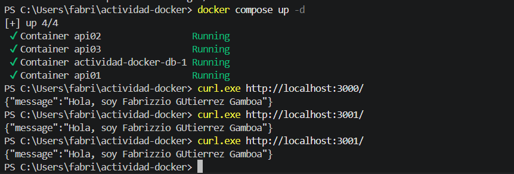

# Laboratorio 02

Fabrizzio Martin Gutierrez Gamboa

Despliegue de tres API y una base de datos PostgreSQL con Docker Compose.

## API

Se utilizó nmatsui/hello-world-api. El código se descargó con:

```bash
git clone https://github.com/nmatsui/hello-world-api.git api
```

Se ejecutaron tres copias que responden con mi nombre:

- api01: http://localhost:3000
- api02: http://localhost:3001
- api03: http://localhost:3002

## Base de datos y volumen

Se utilizó postgres:13. En Compose se configuraron POSTGRES_DB, POSTGRES_USER y POSTGRES_PASSWORD.

El volumen postgres_data está montado en /var/lib/postgresql/data. Se comprobó que conserva un registro después de recrear el contenedor.

## Configuración

Crear el archivo .env desde la plantilla, usando PowerShell:

```powershell
Copy-Item .env.example .env
```

Editar MI_NOMBRE y APELLIDO. Estas variables forman el mensaje de las API. La base de datos utiliza valores definidos directamente en Compose.

El archivo .gitignore excluye .env, node_modules/ y *.log.

## Comandos

Construir la imagen local antes del primer despliegue:

```bash
docker build -t actividad-docker-api:1.0 ./api
```

Iniciar los servicios:

```bash
docker compose up -d
```

Verificar contenedores y volúmenes:

```bash
docker compose ps
docker volume ls
```

Detener y eliminar los contenedores, conservando el volumen:

```bash
docker compose down
```

## Tipos de redes en Docker

- Bridge: comunica contenedores del mismo host. Es la utilizada por este proyecto.
- Host: comparte la red del anfitrión.
- None: deshabilita la conectividad externa del contenedor.
- Overlay: comunica contenedores entre diferentes hosts.
- Macvlan: asigna una dirección MAC propia al contenedor.
- IPvlan: utiliza direcciones IP propias compartiendo la MAC de la interfaz principal.

## Tipos de volúmenes y montajes

- Nombrado: Docker administra los datos bajo un nombre elegido.
- Anónimo: Docker asigna automáticamente un identificador al volumen.
- Bind mount: conecta una ruta del anfitrión con el contenedor.
- Tmpfs: guarda datos temporales en memoria.

Bind mount y tmpfs son alternativas de montaje, distintas de los volúmenes administrados por Docker.

## Git

Los avances se registraron con Conventional Commits usando feat, fix, chore y docs.

## Evidencia

Respuestas de las tres API desde la terminal.



## Créditos

- Alumno: Fabrizzio Martin Gutierrez Gamboa.
- ID: 000295267.
- Docente: Walter Ivan Leturia Rodriguez.
- API original: Nobuyuki Matsui. Licencia en api/LICENSE.